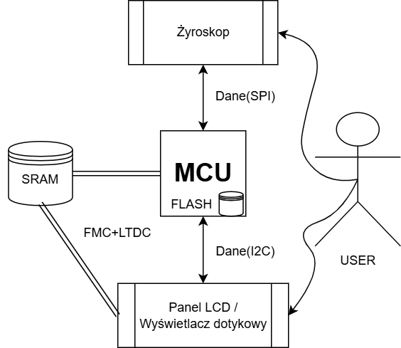
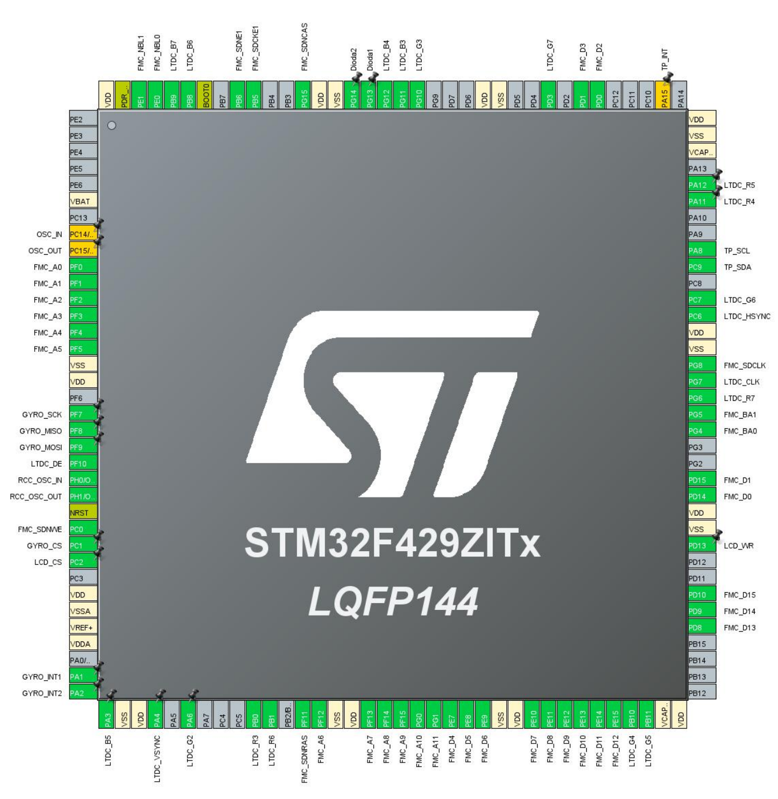

# SpaceInvader - STM32 Embedded System

Implementation of the classic "Space Invaders" game, built from scratch for the STM32F429I-DISC1 board. The core game logic is object-oriented and written in C++, while the low-level hardware drivers and peripheral configurations are handled in C using HAL. I intentionally avoided external GUI frameworks like LVGL or TouchGFX. The graphics engine is entirely custom, writing directly to the frame buffer in the external SDRAM. All peripheral drivers and helper functions were written from the ground up, making STM32 HAL the highest level of external abstraction used in this project.

# System Architecture

The diagram below illustrates the system architecture, including the communication between the microcontroller and peripheral devices:

# Key Features

- Custom Graphics Engine: Direct frame buffer management and rendering optimization. Developed a set of low-level drawing functions using **DMA2D** accelerator for high-speed data transfers and pixel blending. Implemented double buffering to eliminate screen tearing.

- State Machine Logic: Architecture managing distinct program states: main menu, active gameplay, and game over/end menu screen.

- Display Controller (LTDC): Custom library developed for TFT display handling. Managing timing, synchronization, and pixel formats at the register level.

- Memory Management (FMC): FMC controller configuration to support external SDRAM, providing the necessary bandwidth for high-resolution frame buffers.

- Sensor Integration: Responsive controls implemented via SPI (gyroscope) and I2C (touch panel), utilizing hardware interrupts for player input.

- Hybrid Language Approach: C++ for object-oriented entity management (aliens, projectiles, player) and C for high-performance, low-level peripheral drivers.

# Tools & Platform

- Evaluation Board: STM32F429I-DISC1 (STM32F429ZI ARM Cortex-M4)

- IDE: STM32CubeIDE

- Language: C & C++

- Peripherals: LTDC, FMC (SDRAM), DMA2D, SPI, I2C, UART

# MCU pinout

Pin configuration and peripheral mapping:

